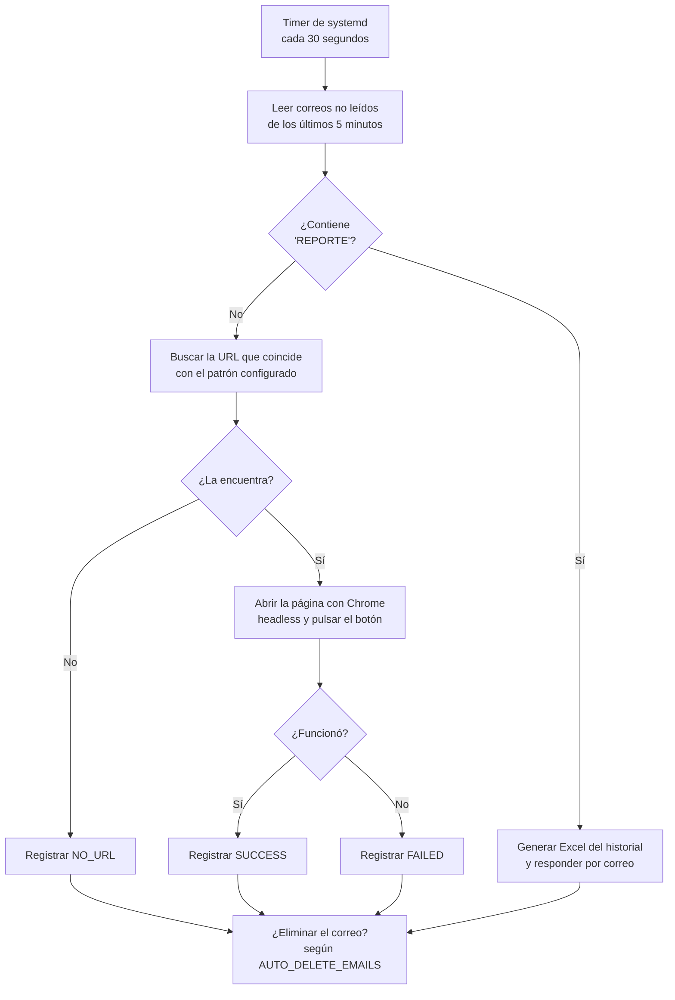

# RPA Netflix — Confirmación automática de ubicación

Automatización que procesa los correos de Netflix de "actualizar ubicación principal": los detecta al llegar, abre el enlace y pulsa el botón de confirmación, sin intervención humana.

Corre sola en el servidor, **cada 30 segundos**, disparada por un timer de `systemd`. También responde por correo con un informe en Excel cuando alguien se lo pide.

---

## Índice de la documentación

| Documento | Para qué sirve | Cuándo lo necesitas |
|---|---|---|
| **Este README** | Qué hace el sistema y cómo está montado | Primera lectura |
| [Manual de operación](docs/OPERACION.md) | Arrancar, detener, ver estado, ver qué procesó | Día a día |
| [Configuración](docs/CONFIGURACION.md) | Todas las variables y qué hace cada una | Cambiar el comportamiento |
| [Solución de incidencias](docs/INCIDENCIAS.md) | Qué hacer ante cada síntoma | Cuando algo falla |
| [Arquitectura](docs/ARQUITECTURA.md) | Cómo funciona por dentro y por qué | Mantenimiento, cambios de fondo |
| [Instalación](docs/INSTALACION.md) | Montarlo en un servidor nuevo | Migrar de servidor |

> **¿Solo quieres saber si está funcionando?**
> ```bash
> systemctl status rpa_system.timer && tail -5 /root/automatizacion/rpa_system.log
> ```

---

## Qué hace, en concreto



Cada ejecución es un **ciclo único**: procesa lo que encuentra y termina. No queda ningún proceso corriendo en segundo plano.

---

## Cómo está montado

| | |
|---|---|
| **Ubicación** | `/root/automatizacion` |
| **Frecuencia** | Cada 30 segundos (`rpa_system.timer`) |
| **Modelo** | Ciclo único: `systemd` lo dispara, procesa y termina |
| **Navegador** | Chrome/Chromium headless vía Selenium |
| **Ventana de correos** | Solo los no leídos de los **últimos 5 minutos** |
| **Base de datos** | SQLite en `rpa_database.db` |
| **Logs** | `rpa_system.log`, con rotación diaria y 30 días de historial |

**Por qué cada 30 segundos y solo 5 minutos hacia atrás:** los correos de Netflix caducan rápido, así que hay que reaccionar en el momento. La ventana corta evita reprocesar correos viejos si el sistema estuvo detenido, y evita que un correo se quede "atascado" si no se pudo marcar como leído.

Un correo puede procesarse en cualquiera de las ~10 ejecuciones siguientes a su llegada, pero **nunca dos veces**: queda marcado como leído en la primera lectura.

---

## Informes por correo

Cualquier correo no leído cuyo **asunto o cuerpo contenga la palabra `REPORTE`** dispara el envío automático de un Excel con el historial completo de la base de datos, respondido al remitente de la solicitud.

Es la forma prevista de consultar el sistema sin entrar al servidor.

---

## Los cuatro desenlaces de un correo

Todo correo procesado termina en uno de estos estados, registrado en la base de datos:

| Estado | Significa |
|---|---|
| `SUCCESS` | Se encontró el enlace y se pulsó el botón correctamente |
| `FAILED` | Se encontró el enlace pero el clic no funcionó |
| `NO_URL` | El correo no contenía ninguna URL que coincidiera con el patrón |
| `ERROR` | Ocurrió una excepción durante el procesamiento |

Los correos que fallan **quedan registrados igualmente**: no se pierde el rastro de nada.

---

## Mapa de archivos

```
automatizacion/
├── rpa/
│   ├── main.py             # Orquesta el ciclo completo
│   ├── email_reader.py     # Lectura IMAP, filtros y extracción de enlaces
│   ├── driver_web.py       # Selenium: abrir la página y pulsar el botón
│   ├── database.py         # SQLite y exportación a Excel
│   └── notifier.py         # Envío de informes por SMTP
├── config/env.example      # Plantilla de configuración
├── rpa_system.service      # Servicio systemd (oneshot)
├── rpa_system.timer        # Timer que lo dispara cada 30 s
├── gestionar_rpa_timer.sh  # Menú interactivo de gestión
├── .env                    # ⚠️ Credenciales (NO se sube a git)
├── rpa_system.log          # Log principal (rota a diario)
├── rpa_database.db         # Historial de correos procesados
└── requirements.txt
```

---

## Seguridad

- El servicio corre bajo `systemd` con `ProtectSystem=strict`, `PrivateTmp=true` y `NoNewPrivileges=true`: solo puede escribir dentro de su propia carpeta.
- Las credenciales viven en `.env`, excluido del repositorio. **Nunca las subas a git.**
- Los logs contienen asuntos y direcciones de correo: tenlo en cuenta al compartirlos.
- `AUTO_DELETE_EMAILS=true` elimina correos de forma **permanente e irrecuperable**.
