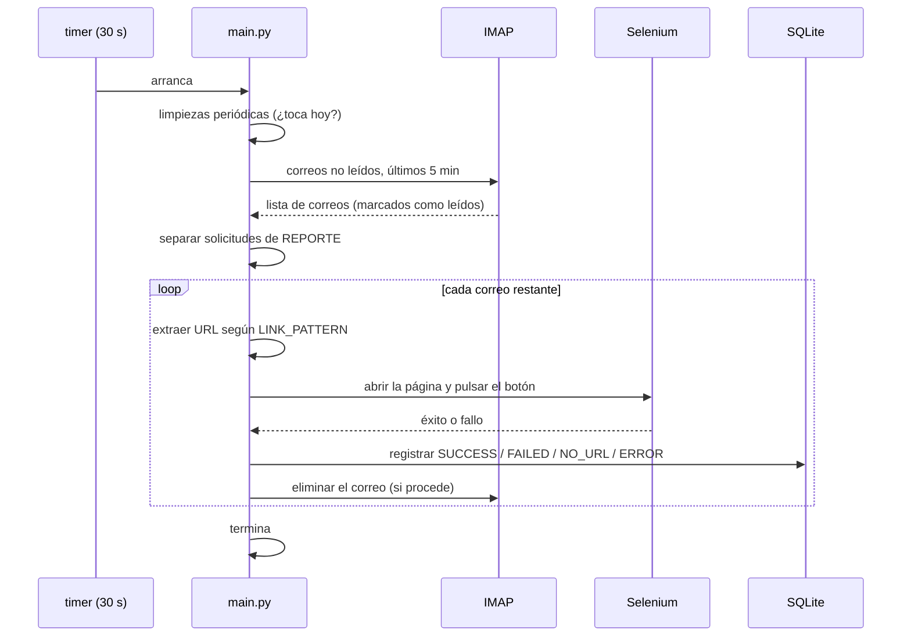

# Arquitectura

Cómo funciona por dentro y por qué está hecho así. Documento de mantenimiento: para operar el sistema no hace falta leerlo.

---

## La idea central

Netflix envía un correo cuando detecta un inicio de sesión desde otra ubicación, y ese correo trae un enlace que hay que abrir y confirmar. El enlace **caduca rápido**, así que la confirmación tiene que ocurrir en minutos.

De ahí salen las dos decisiones que definen el sistema: ejecutarse **muy a menudo** (cada 30 segundos) y mirar solo **una ventana muy corta** de correos (5 minutos).

---

## El modelo de ejecución: ciclo único

El sistema **no es un proceso que corre continuamente**. Cada ejecución:

1. Arranca.
2. Se conecta al correo y procesa lo que encuentre.
3. Termina.

`systemd` lo dispara cada 30 segundos mediante un timer:

```
rpa_system.timer  ──dispara──>  rpa_system.service (oneshot)  ──ejecuta──>  rpa/main.py
```

### Por qué así y no un bucle infinito

| Ventaja | Explicación |
|---|---|
| **Sin fugas** | Cada ciclo empieza limpio: memoria, conexiones IMAP y procesos de Chrome mueren con él |
| **Sin cuelgues permanentes** | Un ciclo colgado se lleva por delante `TimeoutSec=300` y el siguiente arranca igual |
| **Configuración en caliente** | El `.env` se relee en cada ciclo; cambiarlo no requiere reiniciar nada |
| **Sin solapamientos** | `systemd` no lanza dos instancias del mismo servicio a la vez |

El coste es arrancar un intérprete de Python 2880 veces al día. Es barato comparado con depurar un demonio que acumula estado durante semanas.

---

## Anatomía de un ciclo



### Las limpiezas periódicas

Al principio de cada ciclo, antes de tocar el correo, se comprueba si toca limpiar. Como no hay un proceso persistente que lleve la cuenta, **el estado se guarda en archivos de marca** con la fecha de la última ejecución:

| Limpieza | Frecuencia | Archivo de marca |
|---|---|---|
| Registros de más de 30 días en la base de datos | Diaria | `db_cleanup.flag` |
| Caché de Selenium | Cada 7 días | `selenium_cleanup.flag` |

Un patrón sencillo y robusto: sobrevive a reinicios y no necesita ningún planificador aparte.

### La ventana de 5 minutos

`get_unread_emails()` devuelve solo los correos **no leídos** del remitente configurado recibidos en los **últimos 5 minutos**, y los marca como leídos al obtenerlos.

Esa doble condición resuelve dos problemas a la vez:

- **No leído** evita procesar dos veces el mismo correo.
- **Últimos 5 minutos** evita que un correo se quede atascado reintentándose para siempre si no se pudo marcar como leído, y evita un aluvión de reprocesamientos si el sistema estuvo parado un día entero.

Es una decisión con un precio consciente: **si el sistema se detiene más de 5 minutos, esos correos no se recuperan**. Para este caso de uso da igual, porque los enlaces caducan de todos modos.

### El registro es innegociable

Todo correo procesado acaba en la base de datos, pase lo que pase:

| Situación | Tabla | Estado |
|---|---|---|
| Clic correcto | `rpa_success` | `SUCCESS` |
| Clic fallido | `rpa_failed` | `FAILED` |
| Sin URL que coincida | `rpa_failed` | `NO_URL` |
| Excepción | `rpa_failed` | `ERROR` |

`NO_URL` merece una mención: en versiones anteriores, un correo sin enlace válido se ignoraba en silencio. Ahora se registra. La diferencia importa cuando Netflix cambia sus URLs — el problema se ve en los datos en vez de manifestarse como una ausencia de actividad.

---

## Los módulos

| Archivo | Responsabilidad | Detalle relevante |
|---|---|---|
| `rpa/main.py` | Orquesta el ciclo | Decide qué se elimina y qué se registra |
| `rpa/email_reader.py` | IMAP | Filtros, extracción de enlaces, timeouts |
| `rpa/driver_web.py` | Selenium | Chrome headless con ~20 opciones de optimización |
| `rpa/database.py` | SQLite | Tablas, limpieza y exportación a Excel |
| `rpa/notifier.py` | SMTP | Envío del informe con adjunto |

### Extracción del enlace

`extract_link_from_email()` busca en dos pasadas: primero en el HTML del correo (con BeautifulSoup, mirando los `href`), y si ahí no encuentra nada, en el texto plano con una expresión regular. La primera vía es la fiable; la segunda es el respaldo para correos mal formados.

En ambos casos el criterio es el mismo: quedarse con la URL que empieza por `LINK_PATTERN`.

### Chrome headless

`driver_web.py` levanta Chrome con una lista larga de opciones (`--headless`, `--no-sandbox`, `--disable-images`, `--disable-extensions`, y muchas más) con un objetivo claro: **arrancar rápido y consumir poco**, porque se lanza un navegador entero para hacer un único clic, muchas veces al día.

---

## Registro y observabilidad

**Log de archivo** (`rpa_system.log`): lo escribe `logging` de Python con un `TimedRotatingFileHandler`. Cada medianoche el archivo del día pasa a `rpa_system.log.AAAA-MM-DD` y se conservan **30 días**; el más antiguo se borra al rotar.

La rotación existe por una razón concreta: con 2880 ejecuciones diarias, un archivo único llegó a **472 MB y 5,9 millones de líneas**, lo que lo volvía inservible para consultarlo.

**Journal de systemd**: el servicio manda su salida estándar a `journalctl`, que aplica su propia rotación. Sirve para diagnosticar fallos *anteriores* a que el logging de Python arranque (por ejemplo, un error de importación).

```bash
tail -f rpa_system.log                          # lo que hace el sistema
sudo journalctl -u rpa_system.service -n 50     # por qué no arrancó
```

**Base de datos**: el registro estructurado y consultable, la única fuente que sobrevive a la rotación de logs y la que alimenta los informes en Excel.

---

## Seguridad del servicio

La unidad de `systemd` está restringida a propósito:

```ini
NoNewPrivileges=true
PrivateTmp=true
ProtectSystem=strict
ReadWritePaths=/root/automatizacion
```

`ProtectSystem=strict` monta todo el sistema de archivos como solo lectura salvo lo declarado en `ReadWritePaths`. Aunque el proceso corre como root, **solo puede escribir dentro de su propia carpeta**.

> Consecuencia práctica para el mantenimiento: cualquier archivo nuevo que el sistema necesite escribir (logs, base de datos, informes) tiene que estar dentro de `/root/automatizacion`. Una ruta fuera de ahí fallará con "permiso denegado" aunque el usuario sea root.

---

## Riesgos conocidos

| Riesgo | Impacto | Cómo se detecta |
|---|---|---|
| Netflix cambia la URL de confirmación | Todo pasa a `NO_URL` | Registros `NO_URL` en la base de datos |
| Netflix rediseña la página | Todo pasa a `FAILED` | Registros `FAILED` en la base de datos |
| Caduca la contraseña de aplicación | Deja de leer correos | `AUTHENTICATIONFAILED` en el log |
| El sistema se detiene más de 5 minutos | Esos correos se pierden | Hueco temporal en el log |
| Actualización de Chrome incompatible con el driver | Todo pasa a `FAILED` | `Error inicializando Chrome driver` |

Los dos primeros son inevitables al automatizar un producto de terceros sin API. La mitigación es que **el sistema los registra en vez de fallar en silencio**: el problema se ve consultando la base de datos.

---

## Archivos heredados

`gestionar_rpa.sh` y `rpa_runner.sh` son de la etapa anterior, cuando el sistema corría como un servicio continuo con lockfile. **No se usan**: `rpa_runner.sh` incluso apunta a una ruta que ya no existe (`/root/rpa_system`).

Se conservan como referencia histórica. El gestor vigente es `gestionar_rpa_timer.sh`.
